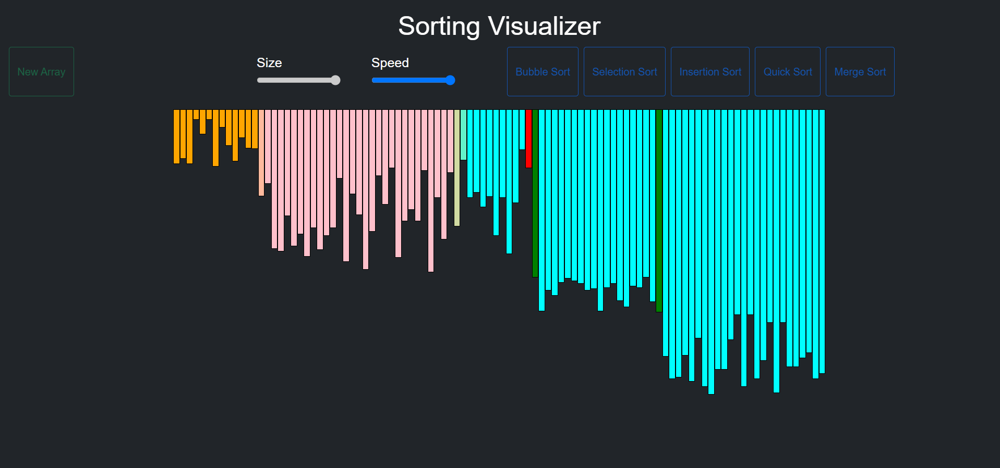
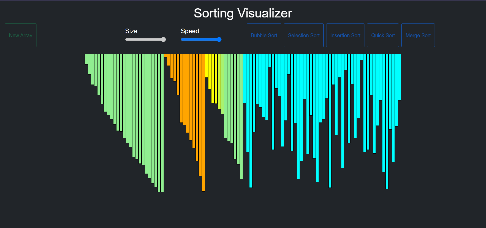

# Sorting_Visualizer_Project
A Project that helps to visualize various Sorting Algorithms.
&nbsp;
It is developed using HTML, CSS, Bootstrap and VanillaJS
# Improvements_to_be_made
--> Adding more algorithms.
&nbsp;
--> Adding play and pause buttons.
&nbsp;
# Quick_Sort

# Merge_Sort

